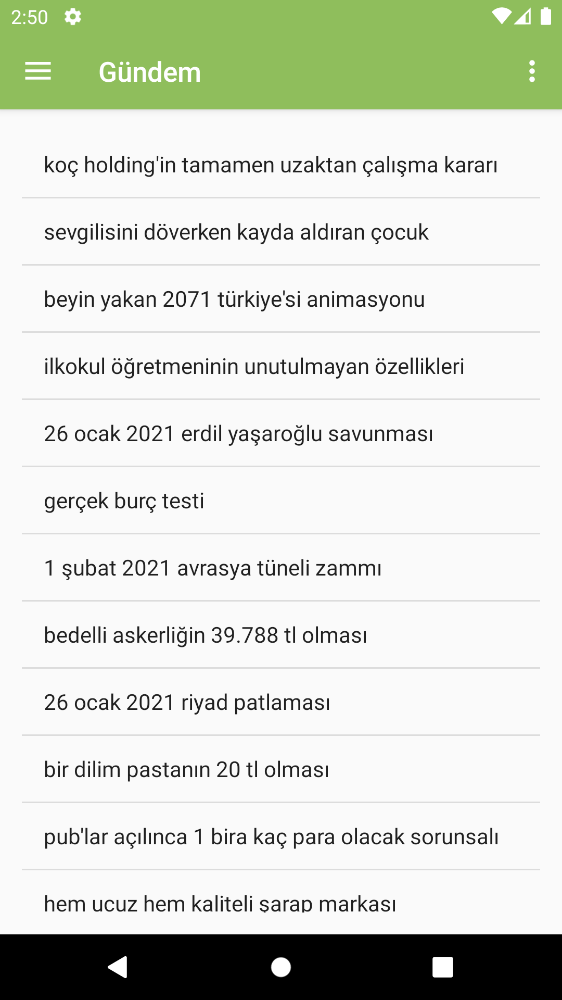
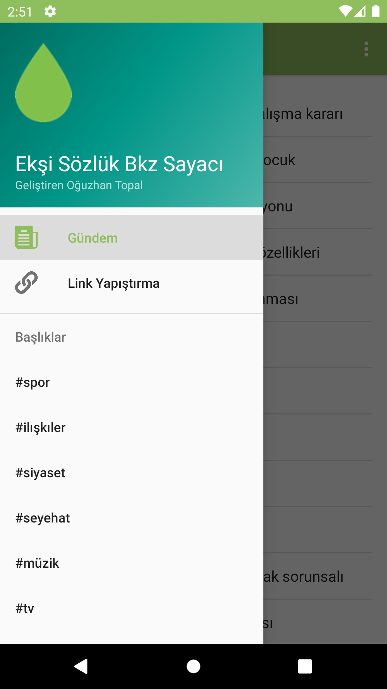
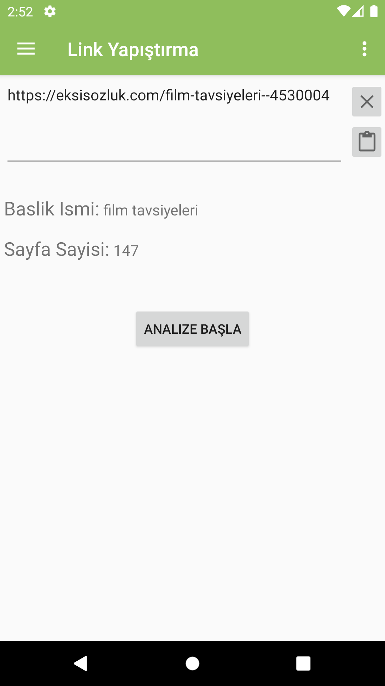
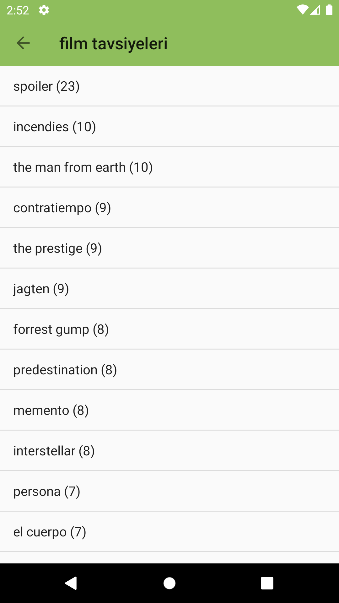

# Eksi-Bakiniz-Sayaci

### Açıklama
<ul>
<li>Ekşi sözlükteki herhangi bir konudaki bakınızları bakınızları sayıp sıralayan android uygulaması.</li>
<li>Güncel konuları görme, kategorilere göre konuları görme ve istenilen konu başlığının linkini yapıştırma özellikleri mevcut.</li>
<li>Java ve Android Studio kullanarak geliştirildi.</li>
</ul>

### Ekran Görüntüleri

